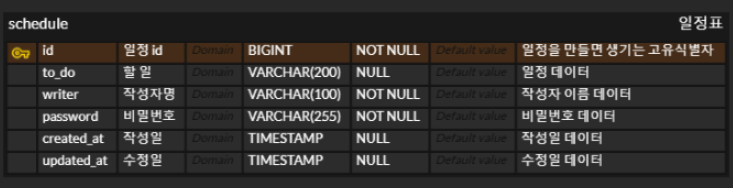

# 일정 관리 API

## 프로젝트 소개
Spring Boot를 사용하여 일정 관리 API를 개발합니다.  
사용자는 일정을 등록, 조회, 수정, 삭제할 수 있습니다.  
이 프로젝트는 MySQL 데이터베이스를 사용하여 데이터를 관리합니다.

---

## 사용 기술
- **Backend**: Spring Boot, Spring MVC, Spring Data JPA
- **Language**: Java 17
- **Build Tool**: Gradle
- **Database**: MySQL
- **Templating Engine**: Thymeleaf
- **Utilities**: Lombok

---

## 기능

### 일정 생성

- 생성 /schedules
- 할일 (내용)
- 작성자
- 비밀번호
- 작성일(자동 생성, 날짜와 시간 포함)
- 수정일(최초만 작성일과 동일 수정 후에 자동 생성)
- 각 일정은 고유 식별자(id)가 자동으로 생성됨

### 전체 일정 조회

- 조회 /schedules
- 조건 조회 ex) 김태정이 작성한 일정 /schedules?writer=김태정

### 선택 일정 조회

- 조회 /schedules/{id}

### 일정 수정

- 수정 /schedules/{id}
- 수정 가능한 항목(할일, 작성자)
- 수정 시 비밀번호 필수
- 작성일은 변경 불가
- 수정일은 수정 후 자동 업데이트

### 일정 삭제

- 삭제 /schedules/{id}
- 특정 일정 삭제 시 비밀번호 필수
---
## Schedule 테이블 구조

`Schedule` 테이블은 일정 정보를 저장하기 위해 사용됩니다. 이 테이블은 다음과 같은 필드로 구성됩니다:

```sql
CREATE TABLE schedule
(
    id          BIGINT       AUTO_INCREMENT PRIMARY KEY NOT NULL,  -- 일정의 고유 ID
    to_do       VARCHAR(200) NULL,  -- 일정 내용 (최대 200자)
    writer      VARCHAR(100) NOT NULL,  -- 일정 작성자
    password    VARCHAR(255) NOT NULL,  -- 일정 수정 및 삭제를 위한 비밀번호
    created_at  TIMESTAMP    DEFAULT CURRENT_TIMESTAMP,  -- 일정 생성 시간 (기본값: 현재 시간)
    updated_at  TIMESTAMP    DEFAULT CURRENT_TIMESTAMP ON UPDATE CURRENT_TIMESTAMP  -- 일정 수정 시간 (기본값: 현재 시간, 수정 시 자동 갱신)
);
```
---
## ERD



---

## API 명세서
|       | HTTP Method | URL | Path Variable | Request Parameter     | Request Body(dto)                                                                                    | Response                                                                                                                                                                                                                                                                                                         | HTTP 상태 코드 |
|-------|-------------|-----|---------------|-----------------------|------------------------------------------------------------------------------------------------------|------------------------------------------------------------------------------------------------------------------------------------------------------------------------------------------------------------------------------------------------------------------------------------------------------------------|------------|
| 일정 생성 | POST        |/schedules| X             | X                     | <pre>{<br/>    “to_do”: “할 일”, <br/>    “writer”: “작성자명”, <br/>    “password”: “1234”<br/>}</pre>    | <pre>{<br/>    “id”: “1”, <br/>    “to_do”: “할 일”, <br/>    “writer”: “작성자명”, <br/>    “created_at”: “작성일”, <br/>    “updated_at”: “수정일” <br/>}</pre>                                                                                                                                                            | 201: 정상 등록 
|전체 일정 조회| GET         |/schedules| X             | /schedules?writer=김태정 | X                                                                                                    | <pre>[<br/>{<br/>    “id”: “1”, <br/>    “to_do”: “할 일”, <br/>    “writer”: “작성자명”, <br/>    “created_at”: “작성일”, <br/>    “updated_at”: “수정일” <br/>}<br/>{ <br/>    “id”: “2”, <br/>    “to_do”: “할 일”, <br/>    “writer”: “작성자명”, <br/>    “created_at”: “작성일”, <br/>    “updated_at”: “수정일”<br/>}<br/>]</pre> | 200: 정상 조회
|선택 일정 조회| GET         |/schedules/{id}| id (Long)     | X                     | X                                                                                                    | <pre>{<br/>    “id”: “1”, <br/>    “to_do”: “할 일”, <br/>    “writer”: “작성자명”, <br/>    “created_at”: “작성일”, <br/>    “updated_at”: “수정일”<br/>}</pre>                                                                                                                                                             | 200: 정상 조회 
|일정 수정| PUT, PATCH  |/schedules/{id}| id (Long)| X                     | <pre>{<br/>    “to_do”: “수정한 일정”, <br/>    “writer”: “작성자명”, <br/>    “password”: “1234"<br/>}</pre> | <pre>{<br/>    “id”: “1”,<br/>    “to_do”: “수정한 일정”, <br/>    “writer”: “작성자명”, <br/>    “created_at”: “작성일”,<br/>    “update_at”: “수정일”<br/>}</pre>                                                                                                                                                             |200: 정상 수정
|일정 삭제|DELETE|/schedules/{id}|id (Long)| X                     | <pre>{<br/>     "password":"1234"<br/>}</pre>                                                        | <pre>{<br/>    “msg”: “일정 삭제 완료!”<br/>}</pre>                                                                                                                                                                                                                                                                    | 200: 정상 삭제                                                                                                                                                                                                                                                                 

---
## 프로젝트 작성자
이 프로젝트는 **김태정**이 개발하였습니다.  
🔗 [김태정 GitHub](https://github.com/xaehub)
